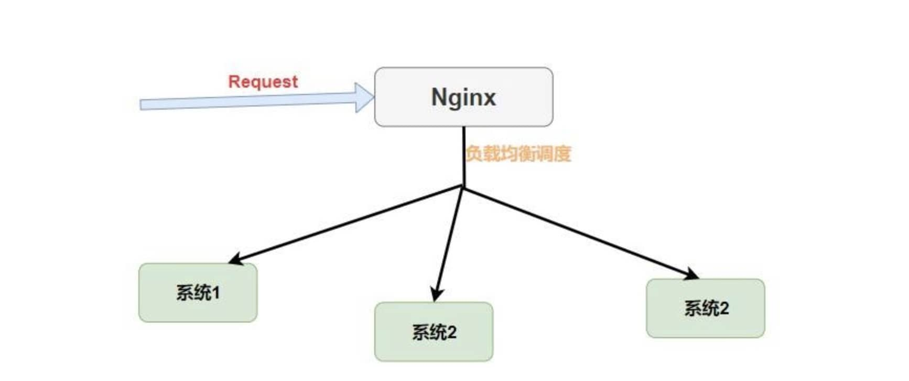
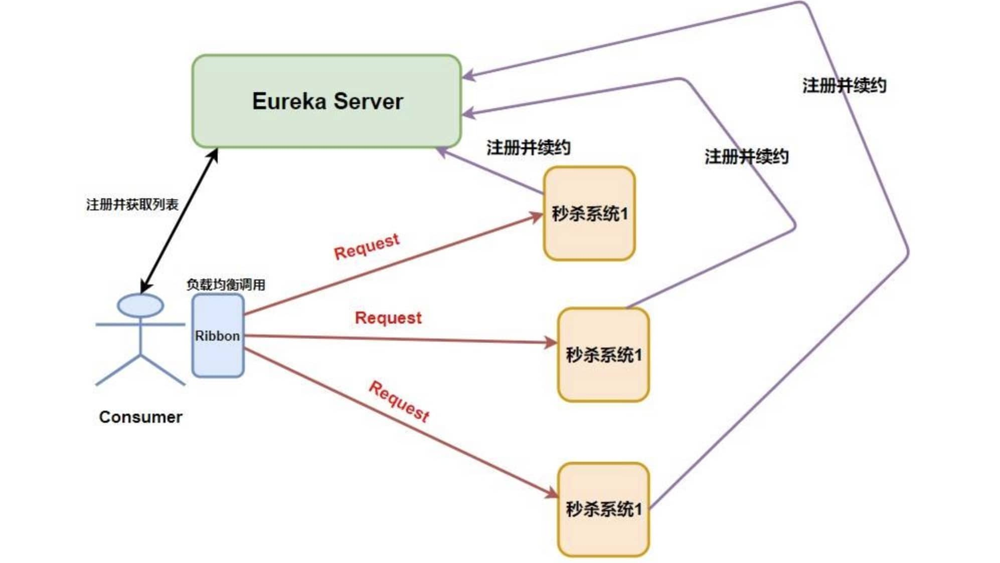

= 02-负载均衡

== Ribbon

客户端/进程内负载均衡器，运行在消费者端。

使用 @LoadBalanced 注解 RestTemplate 实现服务名访问：`restTemplate.getForObject("http://service-hi/hi?name="+name, String.class);`

=== Nginx 和 Ribbon 的对比

nginx 是集中式的负载均衡器。简单理解就是 将所有请求都集中起来，然后再进行负载均衡。

nginx：轮询和加权轮询算法

Ribbon：

. RoundRobinRule：轮询策略。Ribbon 默认采用的策略。若经过一轮轮询没有找到可用的 provider，其最多轮询 10 轮。若最终还没有找到，则返回 null。
. RandomRule: 随机策略，从所有可用的 provider 中随机选择一个。
. RetryRule: 重试策略。先按照 RoundRobinRule 策略获取 provider，若获取失败，则在指定的时限内重试。默认的时限为 500 毫秒。
