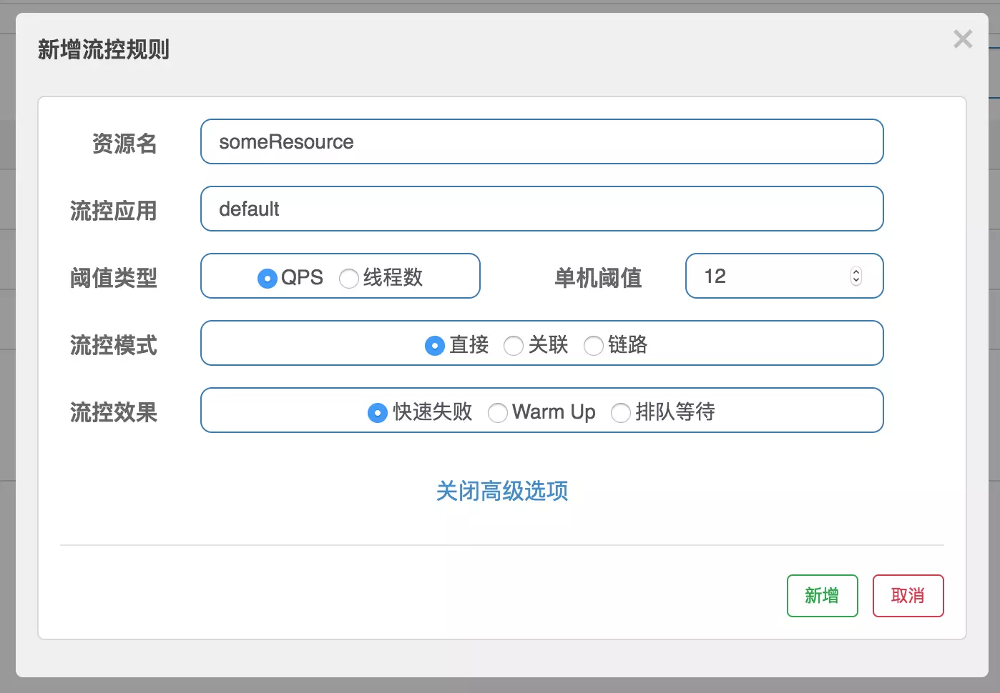
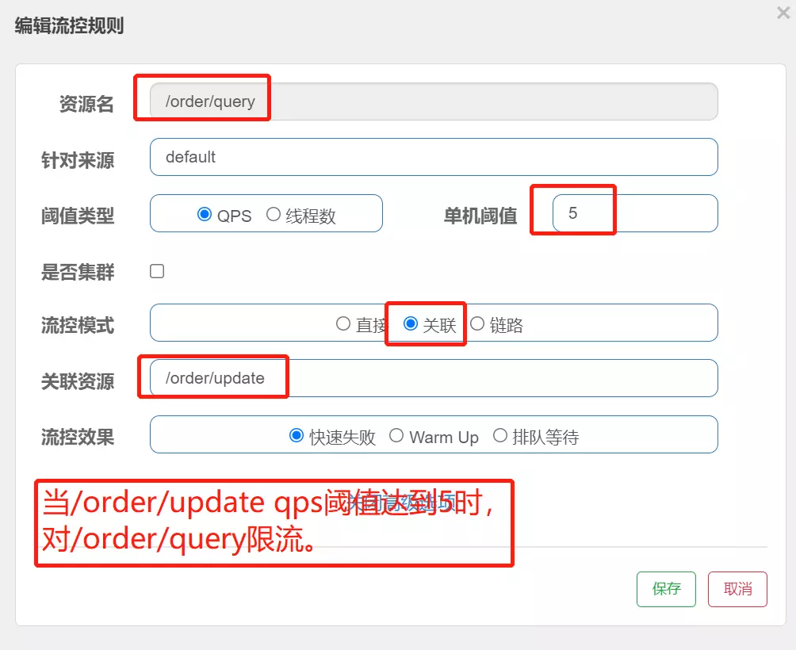
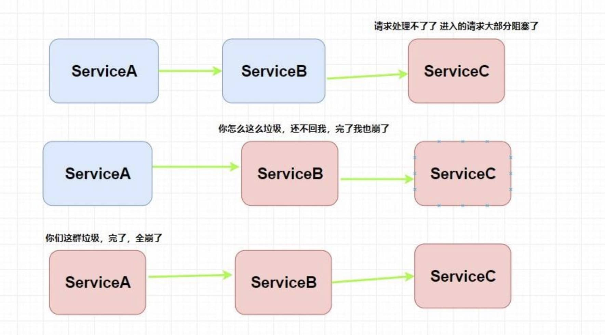

= 04-熔断降级限流

== sentinel

调用关系限流策略：

. 直接

    当 api 大达到限流条件时，直接限流

. 关联

    当关联的资源到达阈值，就限流自己

. 链路

    只记录指定路上的流量，指定资源从入口资源进来的流量，如果达到阈值，就进行限流，api级别的限流

流控效果

. 直接失败
. Warm Up 预热模式

    是应对服务冷启动的一种方案。请求阈值初始值是 threshold / coldFactor，
    持续指定时长后，逐渐提高到threshold值。而coldFactor的默认值是3.
    例如，我设置QPS的threshold为10，预热时间为5秒，那么初始阈值就是 10 / 3 ，也就是3，然后在5秒后逐渐增长到10.

. 排队等待

== Hystrix

雪崩

熔断：当指定时间窗内的请求失败率达到设定阈值时，系统将通过 断路器 直接将此请求链路断开。

断路器模式

[source,java]
----
@HystrixCommand(
    commandProperties = {@HystrixProperty(name = "execution.isolation.thread.timeoutInMilliseconds",value = "1200")}
)
public List<Xxx> getXxxx() {
    // ...省略代码逻辑
}
----

降级

[source,java]
----
// 指定了后备方法调用
@HystrixCommand(fallbackMethod = "getHystrixNews")
@GetMapping("/get/news")
public News getNews(@PathVariable("id") int id) {
    // 调用新闻系统的获取新闻api 代码逻辑省略
}

public News getHystrixNews(@PathVariable("id") int id) {
    // 做服务降级
    // 返回当前人数太多，请稍后查看
}
----
