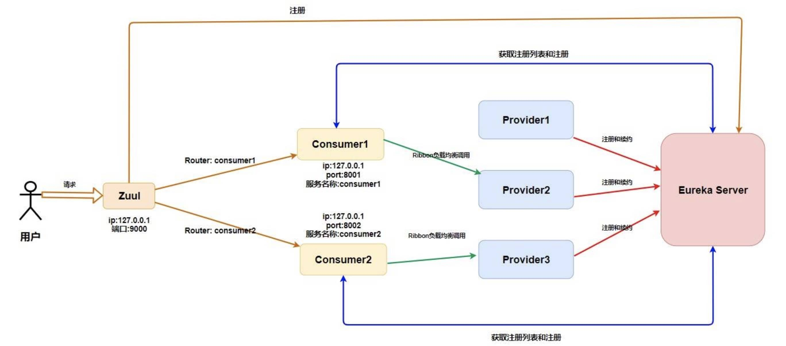

= 05-微服务网关

外网这一层

== Zuul

ZUUL 是从设备和 web 站点到 Netflix 流应用后端的所有请求的前门。作为边界服务应用，ZUUL 是为了实现动态路由、监视、弹性和安全性而构建的。

简单来讲网关是系统唯一对外的入口，介于客户端与服务器端之间，用于对请求进行鉴权、限流、 路由、监控等功能。

=== 功能

==== 统一前缀

加前缀

==== 路由策略配置

自定义路径

==== 服务名屏蔽

在你配置完路由策略之后使用微服务名称还是可以访问的，这个时候你需要将服务名屏蔽。

==== 路径屏蔽

==== 敏感请求头屏蔽

=== 过滤功能

=== 限流

=== 权限校验
