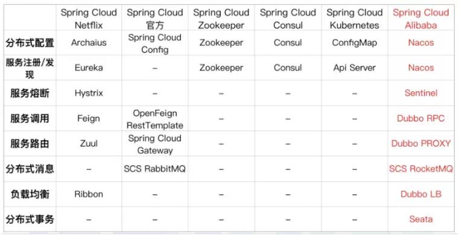

= Spring Cloud Alibaba

spring gateway

    网关、限流（功能不够强大）

openfeign

    Rest -> RPC

Sentinel 降级、限流（管理后台）、熔断

    有个管理后台
    操作时先跳过操作，后面服务正常再补偿
    @FeignClient fallback

    降级，会去调用，但是会失败
    熔断，直接调降级的机制，通过调用失败比例熔断，后面服务恢复可以不再熔断服务

QPS 怎么算？Metric

旧对比

